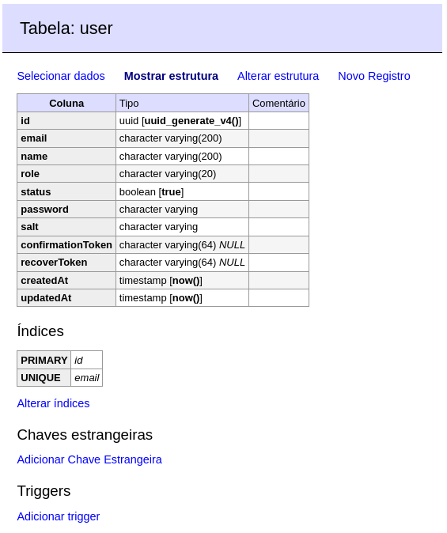

# REST API NestJs com Docker e PostgreSQL

[](http://nestjs.com)

[](https://www.npmjs.com/\~nestjscore) [](https://www.npmjs.com/\~nestjscore)

## API NestJs com PostgreSQL


#### :page\_facing\_up:Descrição

Recentemente comecei a estudar Node pensei em desenvolver uma API com funcionalidades básicas, que praticamente todo projeto precisa, como forma de me familiarizar com a linguagem. Para me auxiliar nessa tarefa utilizei o framework NestJS.

O NestJS é um framework back-end que auxilia o desenvolvimento de aplicações eficientes. escaláveis e confiáveis em cima do [Node.js](https://www.treinaweb.com.br/blog/node-js-por-que-voce-deve-conhecer-essa-tecnologia). O NestJS utiliza como padrão TypeScript e possui uma sintaxe parecida com [Angular](https://www.treinaweb.com.br/blog/o-que-e-o-angular-e-para-que-serve). Falando nisso, o NestJS também utiliza o Express “por baixo dos panos”.

#### Requisitos

O projeto estar no meu Github

:muscle:  Contribuir

```bash
# Clonando projeto
$ git clone https://github.com/CristianoDaSilvaFerreira/rest-api-nestjs.git

# Criando um branch
$ git branch minha-alteracao

# Acessando o novo branch
$ git checkout -b minha-alteracao

# Adicionando os arquivos alterados
$ git add .

# Criando commit e a mensagem
$ git commit -m "Corrigindo...."

# Enviando alterações para o brach
$ git push origin minha-alteracao
```

#### &#x20;Os requisitos de nossa API <a href="#f3ef" id="f3ef"></a>

A ideia é que ao final dessa série tenhamos um projeto com as seguintes funcionalidades:

* Criação de conta para usuários externos
* Criação de conta para usuários Administradores
* Autenticação e Autorização
* Envio de emails para confirmação de cadastro
* Envio de emails para recuperação de senha
* Busca de usuários com filtros e paginação
* Busca de dados de um usuário específico
* Bloquear o acesso de um usuário
* Manter um log do que acontece no servidor

Nossa API utilizará o [PostgreSQL](https://www.postgresql.org) como banco de dados e usaremos o [Docker](https://www.docker.com) para facilitar nossa vida de desenvolvedores.

#### Instalação do NestJS <a href="#2e32" id="2e32"></a>

A primeira coisa que você precisa ter instalada na sua máquina é, claro, o Node.js (e junto com ele, o npm). Para isso basta seguir as instruções no [site](https://nodejs.org/en/).

```bash
$ npm i -g @nestjs/cli
```

Caso tenha algum problema durante a instalação, certifique-se de que tem as permissões necessárias, ou utilize o sudo se estiver no Linux e for necessário.

Nesse caso estarei criando o projeto dentro do diretório Documentos e na pasta GitHub

```bash
# Entrando no diretório Documentos/GitHub
$ cd Documentos/GitHub

# Dentro desse diretório criar o projeto
$ nest new rest-api-nestjs
```

Após a execução deste comando, basta selecionar o gerenciador de dependências de preferência, nesse caso estarei utilizando o `npm` como gerenciador de dependências. Ao finalizar o comando de geração da base de seu projeto, podemos entrar dentro do diretório:

```bash
$ cd rest-api-nestjs
```

Estrutura de pastas básicas do projeto:

.png>)

#### Executando o projeto

Para com que possa roda o projeto e conferir se tudo estar certo

```bash
$ npm run start:dev
```

No navegador poderá acessar a página [http://localhost:3000/](http://localhost:3000), se tudo estiver certo, aparecerá uma mensagem "Hello World!", isso e sinal que a criação do projeto funcionou.

#### Configuração do PostgreSQL com o Docker <a href="#d73a" id="d73a"></a>

Utilizarei o `Docker` em conjunto com o `Docker Compose` para configuração do ambiente. Caso não deseje utilizar o `Docker` para configuração do ambiente pode instalar o PostgreSQL em sua máquina e configurar um usuário e senha para acesso.

Adicionando um arquivo `docker-compose.yml` na raiz de nosso projeto com as configurações de nossos `containers`.

```ts
version: '3'

services:
  pgsql:
    image: postgres:alpine
    ports:
      - '5432:5432'
    container_name: 'restapi'
    restart: always
    volumes:
      - pg-data:/var/lib/postgresql/data
    environment:
      POSTGRES_USER: pguserapi
      POSTGRES_PASSWORD: pgpasswordapi

  adminer:
    image: adminer
    restart: always
    ports:
      - 8080:8080

volumes:
  pg-data:
```

Adicionei um container rodando o [adminer](https://hub.docker.com/\_/adminer). Adminer é um sistema de gerenciamento de banco de dados (SGBD) escrito em PHP, bem leve e com todas as funcionalidades necessárias para criação do projeto.

* Subindo nossos containers, para verificar se tudo está certo

```bash
$ docker-compose up -d
```

Caso ainda não tenha o `container` do `Docker` com a imagem do `Postgres`, o comando poderá demora, pois estará fazendo download da imagem no servidor. Após a finalização dele vamos acessar o adminer em [http://localhost:8080/](http://localhost:8080). Selecione o sistema **PostgreSQL**, informe o servidor, que no caso será o nome que demos ao nosso container: **restapi**. Informe o nome de usuário e senha, **pguserapi** e **pgpasswordapi** respectivamente. Caso tenha substituído estes parâmetros em seu arquivo docker-compose.yml certifique-se de substituí-los aqui também. Clique em **Entrar.**

Será redirecionado para a página de gerenciamento de banco de dados. Nela, clique em “Criar Base de dados” e crie o banco de dados **restnestjs.**

#### Conectando com o Banco de Dados <a href="#abdd" id="abdd"></a>

Para conectar nossa aplicação NestJS com o banco de dados que acabamos de criar. Para tal utilizaremos o [TypeORM](https://typeorm.io/#/). Vamos então instalar os pacotes necessários:

```bash
$ npm i --save typeorm @nestjs/typeorm pg
```

Vamos fazer uma limpeza no projeto.

* Apagar a pasta **test** por completo
* Remover _app.controller.spec.ts_ em **src**
* Remover _app.controller.ts_ em **src**
* Remover _app.service.ts_ em **src**

Lembre-se também de remover os respectivos imports no arquivo `app.module.ts`:

```ts
import { Module } from '@nestjs/common';

@Module({
  imports: [],
  controllers: [],
  providers: [],
})
export class AppModule {}
```

Ficará com essa estrutura

.png>)

**Dentro da pasta src vamos criar uma pasta configs e dentro dela vamos criar o arquivo \_typeorm.config.ts**\_**:**

```ts
import { TypeOrmModuleOptions } from '@nestjs/typeorm';

export const typeOrmConfig: TypeOrmModuleOptions = {
  type: 'postgres',
  host: 'localhost',
  port: 5432,
  username: 'pguserapi',
  password: 'pgpasswordapi',
  database: 'restnestjs',
  entities: [__dirname + '/../**/*.entity.{js,ts}'],
  synchronize: true,
};
```

**Adicionar agora o módulo do TypeORM aos imports globais, no arquivo \_app.module.ts.**\_

```ts
import { Module } from '@nestjs/common';
import { TypeOrmModule } from '@nestjs/typeorm';
import { typeOrmConfig } from './configs/typeorm.config';

@Module({
  imports: [TypeOrmModule.forRoot(typeOrmConfig)],
  controllers: [],
  providers: [],
})
export class AppModule {}
```

* Executar o projeto:

```bash
$ npm run start:dev
```

### Criando endpoint <a href="#044a" id="044a"></a>

Esse endpoint será referente à criação de um usuário com privilégios de administrador. Para tal, cria-se módulo de usuários, o módulo do sistema responsável por tratar todas as questões que envolvam os usuários. Para adicionar um novo módulo ao projeto, basta executar o seguinte comando:

```bash
$ nest g module users
```

Este comando cria uma pasta no diretório **src** com o nome do módulo escolhido e dentro dela cria um arquivo de declaração do módulo, nesse caso com o nome `user.module.ts`, e já adiciona a dependência no arquivo `app.module.ts`.

Dentro do pasta **users,** criar uma nova pasta **entities** arquivo `user.entity.ts`, Este arquivo terá a declaração da estrutura do nosso Usuário e será com base nele que o TypeORM irá gerar a tabela no banco de dados.

```ts
import {
  BaseEntity,
  Entity,
  Unique,
  PrimaryGeneratedColumn,
  Column,
  CreateDateColumn,
  UpdateDateColumn,
} from 'typeorm';

@Entity()
@Unique(['email'])
export class User extends BaseEntity {
  @PrimaryGeneratedColumn('uuid')
  id: string;

  @Column({ nullable: false, type: 'varchar', length: 200 })
  email: string;

  @Column({ nullable: false, type: 'varchar', length: 200 })
  name: string;

  @Column({ nullable: false, type: 'varchar', length: 20 })
  role: string;

  @Column({ nullable: false, default: true })
  status: boolean;

  @Column({ nullable: false })
  password: string;

  @Column({ nullable: false })
  salt: string;

  @Column({ nullable: true, type: 'varchar', length: 64 })
  confirmationToken: string;

  @Column({ nullable: true, type: 'varchar', length: 64 })
  recoverToken: string;

  @CreateDateColumn()
  createdAt: Date;

  @UpdateDateColumn()
  updatedAt: Date;
}
```

os campos `createdAt` \_\_ e `updatedAt`, Esses campos serão preenchidos automaticamente pelo TypeORM com timestamp de quando o objeto foi criado/alterado.

* Executando o projeto:

```bash
$ npm run start:dev
```

Ao terminar de executar, podemos observar no painel do Adminer, no banco de dados **`restnestjs`** que foi criado uma tabela **user**, com a estrutura do `users.entity.ts`



Vamos criar uma outra pastar dentro do src com o nome repository, e nele um arquivo `users.repository.ts`, que irá conter a declaração do repositório para acessar o banco de dados.

Um repositório é a camada responsável por realizar a persistência de dados com o banco de dados.

```ts
import { User } from './../entities/user.entity';
import { EntityRepository, Repository } from 'typeorm';

@EntityRepository(User)
export class UserRepository extends Repository<User> {}
```

Adicionar no repositório aos imports do nosso módulo **users**. O NestJS utiliza Injeção de Dependências para realizar o controle de dependências entre diferentes módulos e também mantê-los o mais desacoplado possível. No arquivo `users.module.ts`, que foi gerado automaticamente para nós através da CLI, vamos adicionar nosso repositório aos imports como um módulo do TypeORM:

```ts
import { UserRepository } from './repository/users.repository';
import { TypeOrmModule } from '@nestjs/typeorm';
import { Module } from '@nestjs/common';

@Module({
    imports: [TypeOrmModule.forFeature([UserRepository])]
})
export class UsersModule {}

```

Criar a camada de serviço do módulo, responsável por tratar da lógica básica por trás da execução de nossos endpoints.

```bash
$ nest g service users --no-spec
```

O parâmetro `no-spec` serve apenas para que não seja criado um arquivo de testes junto com o Service. Além de gerar o arquivo `users.service.ts` automaticamente para nós, o comando ainda adiciona no nosso arquivo `users.module.ts` a devida dependência.

É interessante observar o uso do **Decorator** `@Injectable` que é o responsável por fazer com que nossa classe faça parte do sistema de Injeção de Dependências do NestJS.

```ts
import { UserRepository } from './repository/users.repository';
import { Injectable } from '@nestjs/common';
import { InjectRepository } from '@nestjs/typeorm';

@Injectable()
export class UsersService {
    constructor(
        @InjectRepository(UserRepository)
        private userRepository: UserRepository,
      ) {}
}
}
```

Adicinar no `users.service.ts` o método **createAdminUser** que será responsável por tratar da criação de nosso usuário administrador. Para isso o método receberá como parâmetros o email, o nome, a senha e a confirmação de senha do usuário. Por isso utilizaremos o DTO (_Data Transfer Object_).

Um DTO é um objeto que será composto pelos dados que serão utilizados entre diferentes métodos da aplicação com um objetivo em comum. Dessa forma, vamos criar então nosso _create-user.dto.ts_ em uma nova pasta **dtos** dentro de nosso módulo **users**.

```ts
export class CreateUserDto {
  email: string;
  name: string;
  password: string;
  passwordConfirmation: string;
}
```

Para manter o `users.service.ts`limpo e conciso criamos a lógica do processo de criação em um repositório separado. Mas antes cria-se uma pasta chamada **Enum** e um arquivo `users-roles.enum.ts`, isso dentro da pasta **users** que terá roles (rodas)

```ts
export enum UserRole {
  ADMIN = 'ADMIN',
  USER = 'USER',
}
```

Adicionar ao nosso `users.repository.ts` a lógica para criação de um usuário. Mas antes disso vamos adicionar o pacote `bcrypt` que será responsável por codificar nossas senhas, seguindo boas práticas de segurança.

```bash
$ npm i --save bcrypt
```

```ts
import { UserRole } from './../Enum/user-roles.enum';
import { CreateUserDto } from './../dtos/create-user.dto';
import { User } from './../entities/user.entity';
import { EntityRepository, Repository } from 'typeorm';
import * as bcrypt from 'bcrypt';
import * as crypto from 'crypto';
import {
  ConflictException,
  InternalServerErrorException,
} from '@nestjs/common';

@EntityRepository(User)
export class UserRepository extends Repository<User> {
  async createUser(
    createUserDto: CreateUserDto,
    role: UserRole,
  ): Promise<User> {
    const { email, name, password } = createUserDto;

    const user = this.create();
    user.email = email;
    user.name = name;
    user.role = role;
    user.status = true;
    user.confirmationToken = crypto.randomBytes(32).toString('hex');
    user.salt = await bcrypt.genSalt();
    user.password = await this.hashPassword(password, user.salt);
    try {
      await user.save();
      delete user.password;
      delete user.salt;
      return user;
    } catch (error) {
      if (error.code.toString() === '23505') {
        throw new ConflictException('Endereço de email já está em uso');
      } else {
        throw new InternalServerErrorException(
          'Erro ao salvar o usuário no banco de dados',
        );
      }
    }
  }

  private async hashPassword(password: string, salt: string): Promise<string> {
    return bcrypt.hash(password, salt);
  }
}
```

#### Observação

* Criamos o campo **confirmationToken** que será utilizado no futuro para confirmação do email do usuário
* Recebemos como parâmetro no método a função do usuário na forma de nosso RolesEnum, fazendo com que ela possa posteriormente ser reutilizado na criação de um usuário comum
* Fizemos um tratamento especial para o código de erro 23505, que segundo a [documentação do PostgreSQL](https://www.postgresql.org/docs/10/errcodes-appendix.html) é o código de erro retornado quando há conflito de um campo marcado como único — `unique_violation`
* Geramos um **salt** para nosso usuário.

Agora podemos chamar esse método criado no repositório em nosso serviço para criação de nosso usuário:

```ts
 async createAdminUser(createUserDto: CreateUserDto): Promise<User> {
    if (createUserDto.password != createUserDto.passwordConfirmation) {
      throw new UnprocessableEntityException('As senhas não conferem');
    } else {
      return this.userRepository.createUser(createUserDto, UserRole.ADMIN);
    }
  }
```

Criar a rota que irá desencadear esse processo. Rotas são declaradas em `Controllers` no **NestJS**.

```bash
$ nest g controller users --no-spec
```

O parâmentro `users` passado para o `Decorator @Controller` serve para indicar que esse controller irá tratar das requisições feitas para a URI [http://localhost:3000/users/](http://localhost:3000/users/). Adicionando no **controller** o **endpoint** responsável pela criação de um usuário **admin** e que retornará o usuário criado, bem como uma mensagem de sucesso.

Definir um DTO com essas características já que as mesmas podem ser reaproveitadas por outros métodos no futuro:

```ts
import { User } from './../entities/user.entity';

export class ReturnUserDto {
  user: User;
  message: string;
}
```

No `users.controller.ts` podemos agora adicionar o método de criação de usuário administrador:

```ts
import { Controller, Post, Body } from '@nestjs/common';
import { CreateUserDto } from './dto/create-user.dto';
import { UsersService } from './users.service';
import { ReturnUserDto } from './dto/return-user.dto';

@Controller('users')
export class UsersController {
  constructor(private usersService: UsersService) {}

  @Post()
  async createAdminUser(
    @Body() createUserDto: CreateUserDto,
  ): Promise<ReturnUserDto> {
    const user = await this.usersService.createAdminUser(createUserDto);
    return {
      user,
      message: 'Administrador cadastrado com sucesso',
    };
  }
}
```

Repare que utilizamos o `Decorator @Post` como forma de identificar o método `HTTP` que deverá ser utilizado para acessar a rota. Podemos passar como parâmetro para esse Decorator o caminho da URI que ele irá tratar. Como nenhum caminho foi especificado fica subentendido que ele irá tratar o caminho “/”, ou seja, [http://localhost:3000/users/](http://localhost:3000/users/).

Agora testando o endpoint nesse caso estarei usando o Insomnia, mas pode usar o Postman, envia-se a seguinte requisição

```ts
{
	"name": "Admin",
	"email": "admin@gmail.com",
	"password": "@123Abc",
	"passwordConfirmation": "@123Abc"
}
```

Obterá uma resposta do tipo

.png>)

E se acessar o Adminer também podemos conferir que nosso usuário foi salvo no banco de dados.

Até agora, nenhuma validação está sendo feita na API para garantir que todos os dados necessários para a criação de um usuário estão sendo recebidos. O que acontece se recebermos uma requisição diferente do esperado? Receberemos um **erro 500** com uma mensagem \_“Erro ao salvar o usuário no banco de dados”, conforme especificamos no nosso repositório.

Agora para fazer uma validação iremos utilizar um pacote **class-validator**

```ts
$ npm i --save class-validator class-transformer
```

Ele adiciona uma série de Decorators que podemos utilizar no nosso DTO para especificarmos validações específicas para cada campo, bem como a mensagem de erro que deve ser retornada para cada caso:

```ts
import {
  IsEmail,
  IsNotEmpty,
  MaxLength,
  MinLength,
} from 'class-validator';

export class CreateUserDto {
  @IsNotEmpty({
    message: 'Informe um endereço de email',
  })
  @IsEmail(
    {},
    {
      message: 'Informe um endereço de email válido',
    },
  )
  @MaxLength(200, {
    message: 'O endereço de email deve ter menos de 200 caracteres',
  })
  email: string;

  @IsNotEmpty({
    message: 'Informe o nome do usuário',
  })
  @MaxLength(200, {
    message: 'O nome deve ter menos de 200 caracteres',
  })
  name: string;

  @IsNotEmpty({
    message: 'Informe uma senha',
  })
  @MinLength(6, {
    message: 'A senha deve ter no mínimo 6 caracteres',
  })
  password: string;

  @IsNotEmpty({
    message: 'Informe a confirmação de senha',
  })
  @MinLength(6, {
    message: 'A confirmação de senha deve ter no mínimo 6 caracteres',
  })
  passwordConfirmation: string;
}
```

#### **Usando o ValidationPipe**

Para que essas validações entrem em ação devemos fazer uma pequena alteração no nosso controller, passando o parâmetro ValidationPipe para nosso decorator `@Body` que realiza a extração de dados da requisição:

```ts
import { Controller, Post, Body, ValidationPipe } from '@nestjs/common';
import { CreateUserDto } from './dto/create-user.dto';
import { UsersService } from './users.service';
import { ReturnUserDto } from './dto/return-user.dto';

@Controller('users')
export class UsersController {
  constructor(private usersService: UsersService) {}

  @Post()
  async createAdminUser(
    @Body(ValidationPipe) createUserDto: CreateUserDto,
  ): Promise<ReturnUserDto> {
    const user = await this.usersService.createAdminUser(createUserDto);
    return {
      user,
      message: 'Administrador cadastrado com sucesso',
    };
  }
}
```

 (1).png>)

#### 400 Bad Request

O código de status de resposta HTTP **`400 Bad Request`** indica que o servidor não pode ou não irá processar a requisição devido a alguma coisa que foi entendida como um erro do cliente (por exemplo, sintaxe de requisição mal formada, enquadramento de mensagem de requisição inválida ou requisição de roteamento enganosa). [MDN Web Docs](https://developer.mozilla.org/pt-BR/docs/Web/HTTP/Status/400).

## Autenticação e Autorização <a href="#def7" id="def7"></a>

Quase sempre um dos requisitos de um projeto é que certos recursos do sistema estejam disponíveis apenas para aqueles usuários que possuem um cadastro. E, indo mais além, alguns recursos só podem ser acessados por usuários cadastrados e com autorizações especiais.

### Autenticação via JWT <a href="#185e" id="185e"></a>

[JWT(Json Web Token)](https://jwt.io) é o método de autenticação mais utilizado em APIs, uma vez que como não há uma sessão entre cliente e servidor, a autenticação deve ser feita a cada requisição. Como seria inviável e inseguro enviar nome de usuário e senha junto com cada requisição, o JWT foi uma das maneiras encontradas para se resolver esse problema. É possível aprender mais sobre JWT [clique aqui](https://medium.com/tableless/entendendo-tokens-jwt-json-web-token-413c6d1397f6).

* Para introduzir autenticação à nossa API, vamos criar um módulo **auth.**

```ts
# Gerando o modulo auth
$ nest g module auth

# Criando o controller do auth
$ nest g controller auth --no-spec

# Criando o service do auth
$ nest g service auth --no-spec
```

* Adicionando no módulo o repositório de usuários `auth.module.ts` vai ficar dessa forma:

```ts
import { UserRepository } from './../users/repository/users.repository';
import { TypeOrmModule } from '@nestjs/typeorm';
import { Module } from '@nestjs/common';
import { AuthController } from './auth.controller';
import { AuthService } from './auth.service';

@Module({
  imports: [TypeOrmModule.forFeature([UserRepository])],
  controllers: [AuthController],
  providers: [AuthService]
})
export class AuthModule {}

```

Com o `UserRepository` adicionado podemos criar nosso método para criação de um usuário comum em `auth.service.ts`:&#x20;

```
constructor(
        @InjectRepository(UserRepository)
        private userRepository: UserRepository,
      ) {}
    
      async signUp(createUserDto: CreateUserDto): Promise<User> {
        if (createUserDto.password != createUserDto.passwordConfirmation) {
          throw new UnprocessableEntityException('As senhas não conferem');
        } else {
          return await this.userRepository.createUser(createUserDto, UserRole.USER);
        }
      }
```

Basta chamarmos esse método através do `auth.controller.ts`:

```ts
 constructor(private authService: AuthService) {}

  @Post('/signup')
  async signUp(
    @Body(ValidationPipe) createUserDto: CreateUserDto,
  ): Promise<{ message: string }> {
    await this.authService.signUp(createUserDto);
    return {
      message: 'Cadastro realizado com sucesso',
    };
  }
```

* Inicializando a aplicação

```bash
npm run start:dev
```

.png>)

#### Endpoint de login.

* Primeiro, vamos criar um DTO representando as credenciais de login:

```ts
export class CredentialsDto {
  email: string;
  password: string;
}
```

* Adicionar no `user.entity.ts` o método responsável por conferir a senha de um usuário:

```ts
import * as bcrypt from 'bcrypt';

async checkPassword(password: string): Promise<boolean> {
    const hash = await bcrypt.hash(password, this.salt);
    return hash === this.password;
  }
```

* Nosso `users.repository.ts`, dentro do módulo **users** vamos acrescentar um método para verificação das credenciais de um usuário:

```ts
async checkCredentials(credentialsDto: CredentialsDto): Promise<User> {
    const { email, password } = credentialsDto;
    const user = await this.findOne({ email, status: true });

    if (user && (await user.checkPassword(password))) {
      return user;
    } else {
      return null;
    }
  }
```

* Adicionar o método de login ao `auth.service.ts`:

```ts
async signIn(credentialsDto: CredentialsDto) {
    const user = await this.userRepository.checkCredentials(credentialsDto);

    if (user === null) {
      throw new UnauthorizedException('Credenciais inválidas');
    }
  }
```

- ***

```
$ npm i --save passport passport-jwt @nestjs/jwt @nestjs/passport
```

* Registar o módulo JWT dentro do `auth.module.ts`

```
import { JwtModule } from '@nestjs/jwt';

JwtModule.register({
      secret: 'super-secret',
      signOptions: {
        expiresIn: 18000,
      },
    }),
```

* Finalizando o método de login no `auth.service.ts`

```
 const jwtPayload = {
      id: user.id,
    };
    const token = await this.jwtService.sign(jwtPayload);

    return { token };
```

* Incluir esse endpoint no `auth.controller.ts`:

```
 @Post('/signin')
  async signIn(
    @Body(ValidationPipe) credentiaslsDto: CredentialsDto,
  ): Promise<{ token: string }> {
    return await this.authService.signIn(credentiaslsDto);
  }
```

Inicializar o servidor e testar o login

.png>)

* Criar um endpoint para que um usuário autenticado consiga obter seus próprios dados de cadastro da API.

Primeiramente,  criar uma estratégia de validação, criando o arquivo `jwt.strategy.ts` __ dentro do módulo **auth**:

```
import { CredentialsDto } from './../users/dtos/credentiais.dto';
import { CreateUserDto } from './../users/dtos/create-user.dto';
import { AuthService } from './auth.service';
import { Controller, Post, ValidationPipe, Body } from '@nestjs/common';

@Controller('auth')
export class AuthController {
  constructor(private authService: AuthService) {}

  //   Endpoint de SignUp
  @Post('/signup')
  async signUp(
    @Body(ValidationPipe) createUserDto: CreateUserDto,
  ): Promise<{ message: string }> {
    await this.authService.signUp(createUserDto);
    return {
      message: 'Cadastro realizado com sucesso',
    };
  }

  //   Endpoint de signIn de usuário
  @Post('/signin')
  async signIn(
    @Body(ValidationPipe) credentiaslsDto: CredentialsDto,
  ): Promise<{ token: string }> {
    return await this.authService.signIn(credentiaslsDto);
  }
}

```

Basicamente  foi criar uma estratégia para autenticação JWT onde, ao identificar um token no cabeçalho da requisição, irá validá-lo e extrair dele o id do usuário que enviou a requisição. Com o id do usuário  buscará os dados referentes a ele no banco de dados e retornar essa entidade ao final da validação do token.

Deixar essa nossa estratégia visível para todo o módulo, além de exportá-la para outros módulos utilizarem quando necessitarem de autenticação. Para isso modificaremos o `auth.module.ts`:

```
@Module({
  imports: [
    TypeOrmModule.forFeature([UserRepository]),
    PassportModule.register({ defaultStrategy: 'jwt' }),
    JwtModule.register({
      secret: 'super-secret',
      signOptions: {
        expiresIn: 18000,
      },
    }),
  ],
  controllers: [AuthController],
  providers: [AuthService, JwtStrategy],
  exports: [JwtStrategy, PassportModule],
})
```

* Adicionar o endpoint ao `auth.controller.ts`:

```
@Get('/me')
  @UseGuards(AuthGuard())
  getMe(@Req() req): User {
    return req.user;
  }
```

Usando  o `@UseGuards()`_. Que_ é o responsável por incluir Guards a um endpoint, que nada mais são do que uma forma de restringir o acesso ao recurso. Nesse caso utilizando o  `AuthGuard()`, que já nos é fornecida pelos pactes que instalamos anteriormente.

Repare que ao buscar os dados do usuário dentro da requisição que chega ao **controller**. Por padrão os dados do usuário autenticado, conforme retornado pelo método `validate` __ no _j_`wt.strategy.ts`, são adicionados à requisição dentro da chave `user`_._ Para entender mais sobre **Guards**, pode acessar a [documentação](https://docs.nestjs.com/guards).

Podemos substituir isso por um simples decorator. Fazendo isso, criando dentro do módulo **auth** o arquivo `get-user.decorator.ts`_:_


```
import { User } from './../users/entities/user.entity';
import { createParamDecorator } from '@nestjs/common';

export const GetUser = createParamDecorator(
  (data, req): User => {
    return req.user;
  },
);
```


**Uma observação:** Com o **Nest 7.0.0** houve uma alteração no formato da requisição. Sendo assim, nosso `get-user.decorator.ts` __ fica assim agora:

```
import { User } from './../users/entities/user.entity';
import { createParamDecorator } from '@nestjs/common';

export const GetUser = createParamDecorator(
  (data, req): User => {
    const user = req.args[0].user;
    return user;
  },
);
```

Em ambos os casos o decorator nada mais faz do que retornar o objeto do usuário de dentro da requisição. Podemos agora incluí-lo no `auth.controller.ts:`


#### License

Nest is [MIT licensed](LICENSE/).
